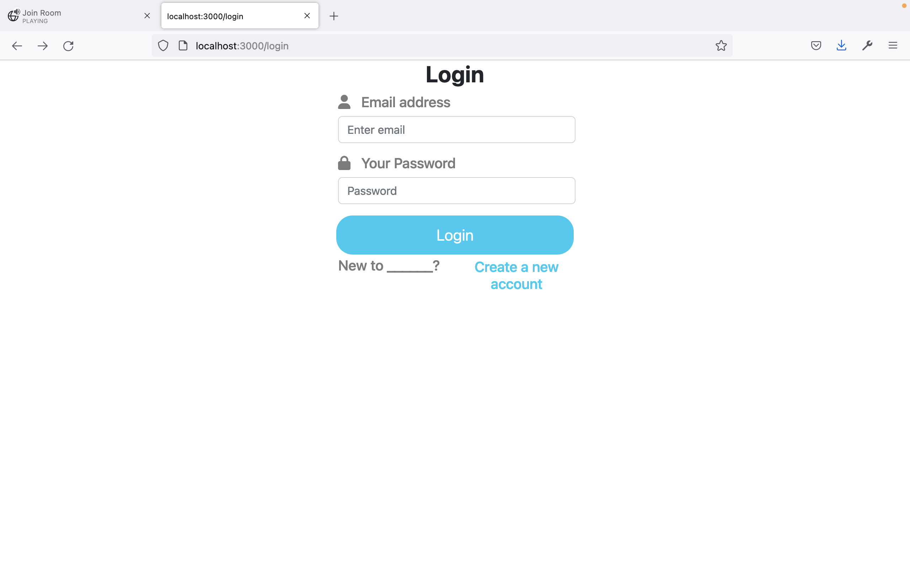
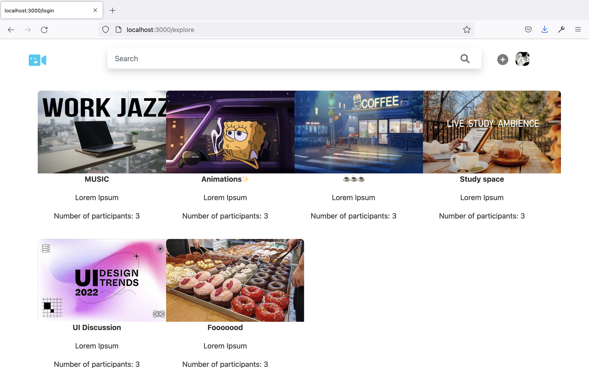
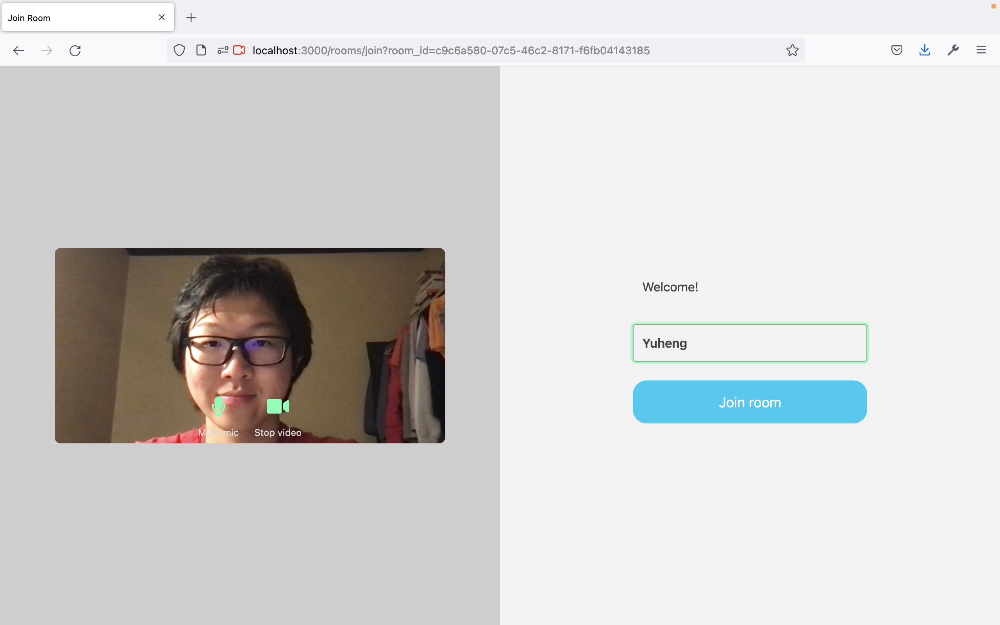
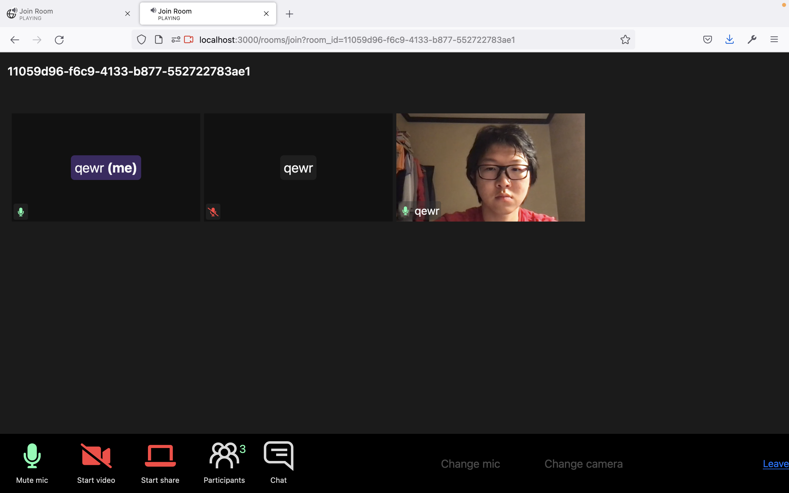

# OpenVideo

Developed during Hack Midwest 2022 @ Kansas City

A video only social media. Only live content. </br>
Registered users can join any discussion room.

## Sample Use Cases
Online Study Room </br>
Virtual Career Fair </br>
Keyboard Enthusiasts Virtual Meet </br>


<p align="center">
  <!-- img src="./public/left.PNG" width="351" height="759" --->
  
  
  
  
</p>

## Author
Yuheng Ding
d.yuheng@wustl.edu <br/>
Danni Liu <br/>
James Hanselman <br/>
Elen Bhattarai <br/>


## To Build

Run the development server:

```bash
yarn install
yarn dev
```
